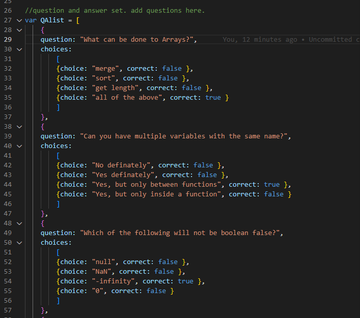
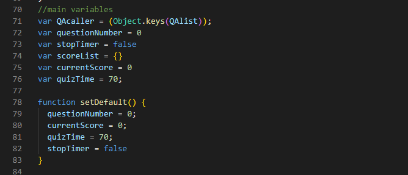

# Quiz

## Description

This application will have a timed multiple choice quiz about coding.
The purpose of this project was to practice DOM manipulation with javascript.
## Installation

You can use this web app just by going to the following url:

## Usage

Questions can be added and modified in the following format.
mark the correct key value as boolean true for correct answers, and false
for wrong answers.

Longer list of questions will need longer time. Timer length can be modified by changing the value(in seconds) in line 76 and 81.
They should be same number values.

## Credits

function generateQuestion() was inspired by the javascript from  github user "WebDevSimplified"

link of the Javascript:
[https://github.com/WebDevSimplified/JavaScript-Quiz-App/blob/master/script.js](https://github.com/WebDevSimplified/JavaScript-Quiz-App/blob/master/script.js).
